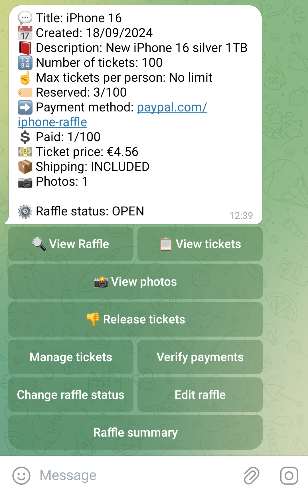
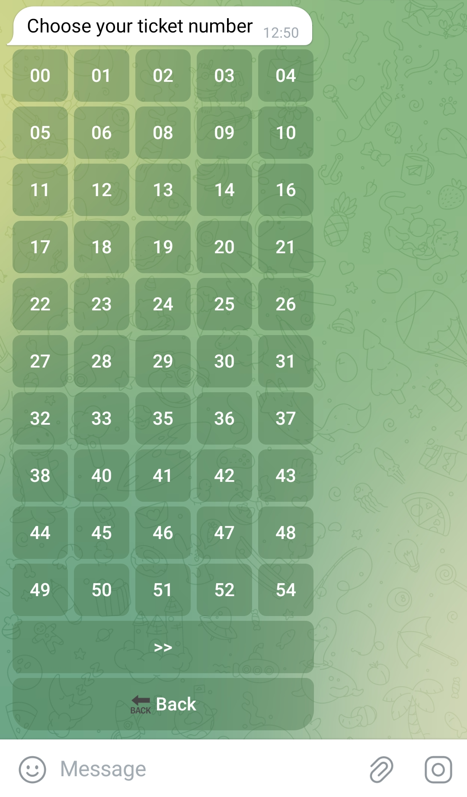
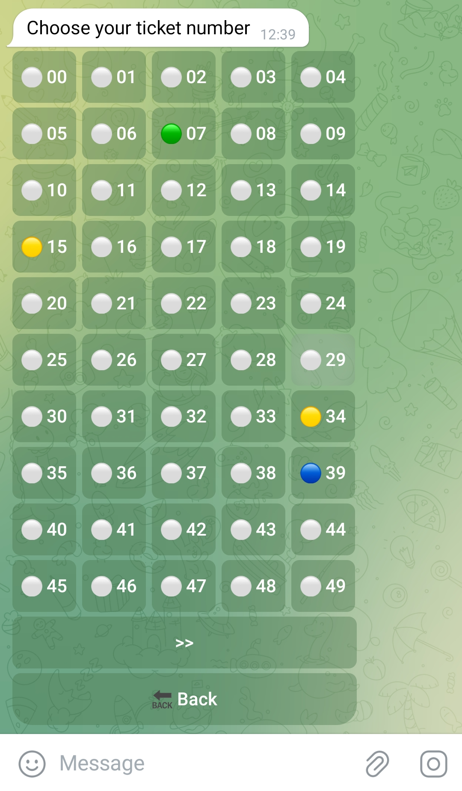

# 🤖 Raffle bot for Telegram
This Telegram bot is designed for organizing product raffles. Users can select a number for a raffle, upload a payment confirmation photo, and track their participation.





## Features:
- User number selection: Participants choose a number for the raffle.
- Payment confirmation upload: Users upload a photo of their payment as confirmation for the selected number.
- Admin panel:
    - Manage raffle numbers.
    - Track users' payment confirmations.
    - Change the status of raffle numbers (e.g., available, reserved, paid).
This system streamlines the process of running raffles, making it easy for admins to monitor entries and for users to participate smoothly.

## Requirements
- Docker
- Docker Compose

## Setup
1. Clone the repository
```bash
git clone https://github.com/danielroig/raffle-bot.git
cd raffle-bot
```

2. Update the environment variables
Create a ```.env``` file in the root of your project by copying the ```.env.example``` file. Edit the newly created ```.env``` file to include your Telegram bot token and any other necessary configuration variables.

4. Run Docker Compose
Start the application with Docker Compose:
```bash
docker-compose build && docker-compose up
```
